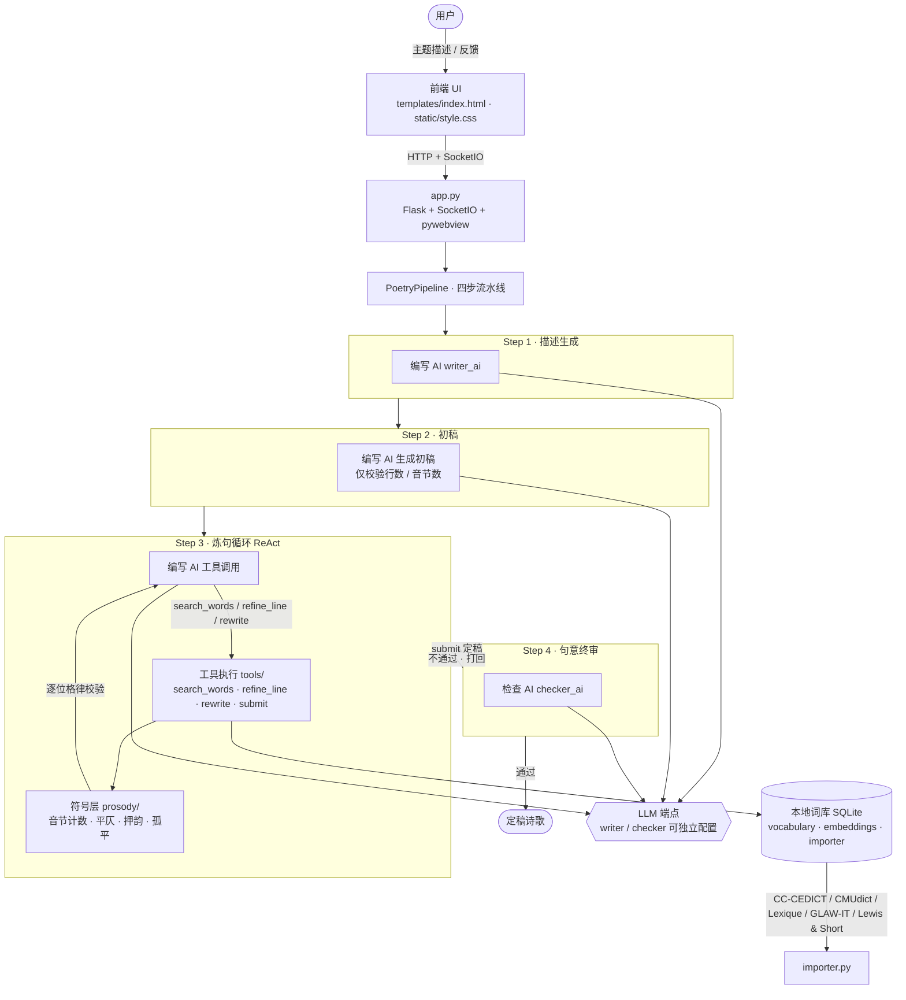

<!-- Copyright (c) 2026 xhdlphzr -->
<!-- SPDX-License-Identifier: MIT -->

# StanzaWeaver

> **以智识，巧织诗** —— 神经符号智能诗歌生成桌面软件

[](https://github.com/xhdlphzr/StanzaWeaver/stargazers)
[](https://github.com/xhdlphzr/StanzaWeaver/issues)
[](https://github.com/xhdlphzr/StanzaWeaver/pulls)
[](https://github.com/xhdlphzr/StanzaWeaver/blob/master/LICENSE)
[](https://github.com/xhdlphzr/StanzaWeaver)
[](https://github.com/xhdlphzr/StanzaWeaver)
[](https://github.com/xhdlphzr/StanzaWeaver)
[](https://github.com/xhdlphzr/StanzaWeaver)

StanzaWeaver 把「AI 的想象力」与「格律的硬规则」编织在一起：现代大模型负责遣词造句与意境构思，一套零 AI 开销的符号引擎负责把每一行诗钉死在平仄、押韵与字数的格子上。两者通过结构化的工具调用解耦，既不让模型天马行空地打破格律，也不让规则僵化成填空题。

---

## 目录

- [项目简介（项目书）](#项目简介项目书)
- [系统架构](#系统架构)
- [核心特性](#核心特性)
- [功能演示](#功能演示)
- [四步生成流水线](#四步生成流水线)
- [Docker 部署](#docker-部署)
- [项目结构](#项目结构)
- [格律模板](#格律模板)
- [LLM 配置](#llm-配置)
- [许可证](#许可证)

---

## 项目简介（项目书）

### 设计理念：神经符号（Neuro-Symbolic）

诗歌是「戴着镣铐跳舞」的艺术。纯神经网络生成常常文采斐然却平仄尽失、韵脚错乱；纯规则系统又能对却毫无灵气。StanzaWeaver 采用**神经符号**架构，让两层各司其职：

| 层                    | 角色       | 实现               | 特点                       |
| --------------------- | ---------- | ------------------ | -------------------------- |
| **符号层**（硬规则）  | 格律裁判   | 纯 Python 校验代码 | 零 AI 开销、确定、可解释   |
| **神经层**（AI 语义） | 诗意创作者 | LLM + Tool Calling | 负责描述、意境、炼句、终审 |

符号层负责：音节计数、平仄/轻重/长短约束、押韵检测、三平尾、孤平、二四六分明等，全部由 Python 代码完成，不消耗任何一次模型调用。神经层负责：从现代文描述生成诗歌主题、构思句意、在约束下反复炼句、以及对成稿做句意终审，通过大语言模型（兼容 OpenAI API 的任意端点）与工具调用实现。

### 为何用工具调用解耦

两层之间**只通过结构化工具通信**，AI 永远不能输出一大段自由文本来「假装」交稿，只能调用以下四个工具给出结构化数据：

- `search_words`：按释义/平仄/韵部检索本地词库，给 AI 提供合规的字词候选；
- `refine_line`：整行替换，每次调用后立即跑一遍全部格律约束；
- `rewrite`：带着指令整体重写；
- `submit`：提交定稿（当且仅当已成功修改过诗句）。

这种「工具即接口」的设计，使 AI 的创造力被牢牢框在格律的边界内，也让每一次修改都可被符号层即时验证——既不会生成不合规的诗句，也不会让 AI 用散文糊弄过去。

### 三要素反馈闭环

编写 AI、检查 AI、用户构成三角反馈：**任意一环不通过，都打回 Step 3 继续炼句**，直到检查 AI 终审通过或用户满意定稿。炼句轮数不设上限，模型可一直精修到通过为止。

---

## 系统架构



---

## 核心特性

- **神经符号双引擎**：硬格律规则由纯 Python 确定性校验，AI 只负责诗意，二者经结构化工具解耦。
- **四步生成流水线**：描述生成 → 初稿（仅验音节数）→ ReAct 炼句循环（搜词 + 整行替换 + 整体重写，每次改动即时全量格律校验）→ 检查 AI 句意终审。
- **三要素反馈闭环**：编写 AI → 检查 AI → 用户，任一环不通过即打回 Step 3 续炼，**炼句轮数无上限**。
- **多语言格律**：中文（五绝 / 七绝 / 五律 / 七律 / 相见欢）、英文（商籁体 / 维拉内拉 / 英雄双行体）、意大利语、法语、古典拉丁语；模板以 Python 类定义，可无限扩展。
- **多层格律校验**：逐位平仄/轻重约束 + 三平尾 + 孤平 + 二四六分明 + 押韵检测（中文按十三辙归并，西语按实时音素韵脚）。
- **实时流式输出**：LLM 生成过程逐 token 推送到前端，Step 详情区持续展开更新。
- **双 AI 代理可分离**：编写 AI（4 工具）与检查 AI（1 工具）可各自配置不同 LLM 端点与模型。
- **本地词库 + 向量重排**：SQLite 词库（CC-CEDICT / CMUdict / Lexique / GLAW-IT / Lewis & Short），`sentence-transformers` 做语义重排。
- **桌面打包分发**：pywebview + Flask + SocketIO，pyinstaller 打包为单文件 exe。

---

## 功能演示

下图展示 StanzaWeaver 的生成界面与炼句过程：


---

## 四步生成流水线

1. **Step 1 · 描述生成**：编写 AI 根据用户输入的现代文主题，提炼出诗歌的主题描述（供后续步骤复用的「创作大纲」）。
2. **Step 2 · 初稿**：编写 AI 依据模板的格律要求（行数、音节数）生成初稿，此阶段仅做行数与音节数校验。
3. **Step 3 · 炼句循环（ReAct）**：AI 反复调用 `search_words` 检索合规字词、`refine_line` 整行替换、`rewrite` 整体重写；每一次修改都立即触发符号层对全诗的格律校验。AI 只有在确实修改过诗句后才允许 `submit`，否则被拒绝并要求继续打磨。**该循环无轮数上限**，直到提交定稿。
4. **Step 4 · 句意终审**：检查 AI 从句意、主题贴合度、格律之外的高级维度评审成稿，调用 `submit` 给出「通过 / 打回」。不通过则携带建议打回 Step 3 继续炼句；通过则定稿。

---

## Docker 部署

以 Web 服务方式运行（无需本地 Python 环境）：

用 `scripts/` 下的一键脚本（Windows 与 Linux/macOS 通用，均支持 `-h` 查看参数）：

| 平台       | 构建                                                | 运行                                                  |
| ---------- | --------------------------------------------------- | ----------------------------------------------------- |
| PowerShell | `.\scripts\build.ps1 [-t tag] [-b base-image] [-n]` | `.\scripts\run.ps1 [-p port] [-d] [-l] [--no-volume]` |
| cmd        | `scripts\build.bat [-t tag] [-b base-image] [-n]`   | `scripts\run.bat [-p port] [-d] [-l] [--no-volume]`   |
| bash       | `./scripts/build.sh [-t tag] [-b base-image] [-n]`  | `./scripts/run.sh [-p port] [-d] [-l] [--no-volume]`  |

示例：`.\scripts\build.ps1 -b docker.m.daocloud.io/library/python:3.14-slim` 构建，`.\scripts\run.ps1 -d -l` 后台运行并跟随日志。

说明：

- **依赖**：直接用项目完整 `requirements.txt`（含桌面 GUI 与嵌入重排组件，功能与本地一致）；Linux 镜像会同时包含这些依赖，镜像较大、首次构建较慢，但构建一次后可复用。
- **数据持久化**：配置、词库、历史记录、日志通过 volume `stanzaweaver-data` 持久化到容器内 `~/.stanza_weaver`。
- **安全设计**：应用仅接受 `localhost`/`127.0.0.1` 的 Host 头（`app.py` 的 `_guard_local_access`），Docker 部署需通过 `http://localhost:5000` 访问；Linux 下也可改用 `network_mode: host`（见 `docker-compose.yml` 注释）。
- **自定义模板**：通过 UI 创建的自定义模板写入容器内 `/app/src/templates/`，容器重建后需重新创建（源码未挂载）。
- **日志**：容器内日志文件位于 `~/.stanza_weaver/logs/stanza.log`（随 volume 持久化），`STANZAWEAVER_LOG_DIR` 可重定向；`docker compose logs` 可看标准输出。

---

## 项目结构

```
StanzaWeaver/
├── .dockerignore
├── .gitignore
├── Dockerfile              # 镜像构建（Python 3.14-slim + 桌面/重排依赖）
├── LICENSE                 # MIT 许可证
├── README.md               # 项目文档
├── Franx.ico               # 应用图标
├── StanzaWeaver.spec       # PyInstaller 构建规格
├── app.py                  # pywebview + Flask + SocketIO 入口
├── docker-compose.yml      # Compose 部署编排
├── requirements.txt        # 项目依赖
├── assets/
│   └── 1.png               # 功能演示截图
├── scripts/                # 跨平台一键构建/运行脚本
│   ├── build.bat
│   ├── build.ps1
│   ├── build.sh
│   ├── run.bat
│   ├── run.ps1
│   └── run.sh
├── static/
│   └── style.css           # 前端样式
├── templates/
│   └── index.html          # 前端 UI
└── src/
    ├── __init__.py
    ├── config.py            # LLM 多端点配置
    ├── logging_setup.py     # 日志初始化（RotatingFileHandler 轮转）
    ├── models/              # 数据模型
    │   ├── __init__.py
    │   ├── syllable.py      # 音节 Syllable
    │   └── word.py          # 词条 Word
    ├── prosody/             # 符号层：格律工具
    │   ├── __init__.py
    │   ├── base.py          # SyllableAnalyzer 抽象基类
    │   ├── chinese.py       # 中文分析器（pypinyin）
    │   ├── english.py       # 英文分析器（CMUdict）
    │   ├── french.py        # 法语分析器
    │   ├── italian.py       # 意大利语分析器
    │   ├── latin.py         # 拉丁语分析器
    │   ├── meter_validator.py   # 格律总校验
    │   └── syllable_counter.py  # 多语言统一音节计数
    ├── knowledge/           # 本地词库
    │   ├── __init__.py
    │   ├── embeddings.py    # sentence-transformers 向量重排
    │   ├── importer.py      # 数据集导入（CC-CEDICT / CMUdict / Lexique / GLAW-IT / Lewis & Short）
    │   ├── schema.sql       # SQLite 建表
    │   └── vocabulary.py    # 查询接口
    ├── agents/              # 神经层：AI Agent
    │   ├── __init__.py
    │   ├── base.py          # LLM 调用封装
    │   ├── checker_ai.py    # 检查 AI（1 工具）
    │   └── writer_ai.py     # 编写 AI（4 工具）
    ├── tools/               # Agent 工具定义
    │   ├── __init__.py      # OpenAI Tool JSON Schema（search_words / refine_line / rewrite / submit）
    │   ├── refine_line.py   # 整行替换执行
    │   └── search_words.py  # 搜词执行
    ├── templates/           # 格律模板（Python 类）
    │   ├── __init__.py      # PoetryTemplate 基类 + 注册表
    │   ├── en.py            # 英文模板（商籁体/维拉内拉/英雄双行体）
    │   ├── fr.py            # 法语模板（回旋诗/三韵叠句诗/叙事歌）
    │   ├── it.py            # 意大利语模板（三行体/八行体/歌谣）
    │   ├── la.py            # 拉丁语模板（六步格/哀歌双行体/十一音节诗）
    │   └── zh.py            # 中文模板（五绝/七绝/五律/七律/相见欢）
    └── pipeline/
        ├── __init__.py
        └── pipeline.py      # 4 步流水线 + 打回循环
```

---

## 格律模板

模板以 Python 类形式定义，继承 `PoetryTemplate`，需实现：

| 方法                         | 说明                                    |
| ---------------------------- | --------------------------------------- |
| `get_syllable_constraints()` | 逐位音节约束（供 refine_line 单行校验） |
| `validate_full()`            | 完整规则检查（三平尾、孤平、押韵等）    |
| `describe()`                 | 人类可读的格律描述（供 AI prompt 使用） |

内置模板：五言绝句、七言绝句、五言律诗、七言律诗、相见欢、莎士比亚商籁体、维拉内拉诗、英雄双行体、意大利语三行体/八行体/歌谣、法语回旋诗/三韵叠句诗/叙事歌、拉丁语六步格/哀歌双行体/十一音节诗。

扩展方式：在 `src/templates/` 下新增 Python 文件，实现模板类后在 `app.py` 中注册；或在 UI 中通过「+ 自定义」生成模板（自动落盘到 `src/templates/custom_*.py`，重启后自动恢复注册）。

---

## LLM 配置

支持任何兼容 OpenAI API 格式的端点（OpenAI / Ollama / vLLM / DeepSeek / Groq 等）：

```json
{
  "writer": {
    "base_url": "https://api.openai.com/v1",
    "api_key": "sk-xxx",
    "model": "gpt-4o"
  },
  "checker": {
    "base_url": "http://localhost:11434/v1",
    "api_key": "ollama",
    "model": "qwen2.5:7b"
  }
}
```

UI 齿轮按钮中直接编辑保存，或手动编辑 `~/.stanza_weaver/config.json`。

### Ollama 本地部署

```json
{
  "writer": {
    "base_url": "http://127.0.0.1:11434/v1",
    "api_key": "ollama",
    "model": "你的本地模型名"
  },
  "checker": {
    "base_url": "http://127.0.0.1:11434/v1",
    "api_key": "ollama",
    "model": "你的本地模型名"
  }
}
```

注意事项：

- **Base URL 必须带 `/v1`**（Ollama 的 OpenAI 兼容端点），否则返回 404。
- 模型名必须是 `ollama list` 中已安装的模型；`:cloud` 云模型需要 Ollama 订阅，否则返回 403。
- **502 Bad Gateway**：通常是 shell 中设置了 `HTTP_PROXY`/`HTTPS_PROXY` 环境变量（如 Clash 等代理工具），本地请求被转发给代理导致。StanzaWeaver 已对 `127.0.0.1`/`localhost` 自动绕过代理直连，若仍出现 502，请检查启动 app 的终端环境变量。

---

## 许可证

所有代码均使用 `MIT` 许可证开源，Copyright (c) 2026 xhdlphzr。

应用图标 `Franx.ico` 、 `Franx.png` 与 `assets/` 目录内所有文件，均 Copyright (c) 2026 xhdlphzr. All rights reserved.
