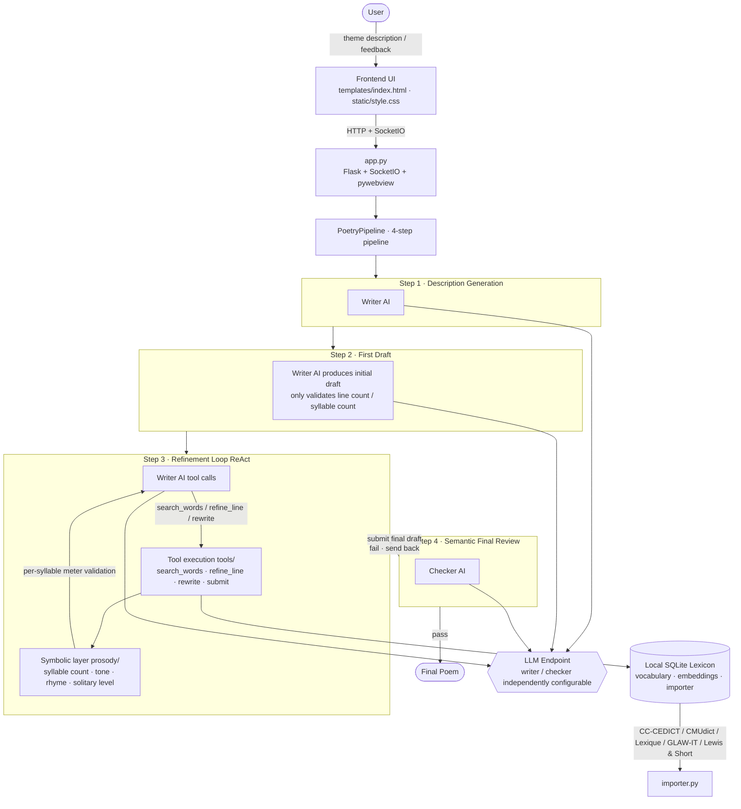
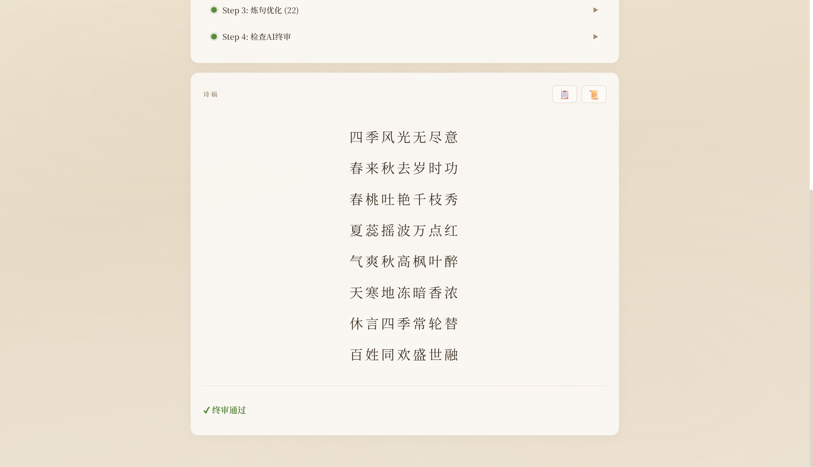

<!-- Copyright (c) 2026 xhdlphzr -->
<!-- SPDX-License-Identifier: MIT -->

# StanzaWeaver

> **Weaving Stanzas with Wisdom** — A Neuro-Symbolic Intelligent Poetry Generation Desktop Application

[](https://github.com/xhdlphzr/StanzaWeaver/stargazers)
[](https://github.com/xhdlphzr/StanzaWeaver/issues)
[](https://github.com/xhdlphzr/StanzaWeaver/pulls)
[](https://github.com/xhdlphzr/StanzaWeaver/blob/master/LICENSE)
[](https://github.com/xhdlphzr/StanzaWeaver)
[](https://github.com/xhdlphzr/StanzaWeaver)
[](https://github.com/xhdlphzr/StanzaWeaver)
[](https://github.com/xhdlphzr/StanzaWeaver)
[](https://github.com/xhdlphzr/StanzaWeaver/blob/master/README.md)
[](https://github.com/xhdlphzr/StanzaWeaver/blob/master/docs/README.zh.md)

StanzaWeaver weaves together the "imagination of AI" and the "hard rules of meter": a modern large language model handles wording, phrasing, and artistic conception, while a zero‑AI‑overhead symbolic engine pins every line to the grid of tone, rhyme, and syllable count. The two are decoupled via structured tool calls—neither letting the model break the rules, nor freezing creativity into a fill‑in‑the‑blanks exercise.

---

## Table of Contents

- [Project Introduction](#project-introduction)
- [System Architecture](#system-architecture)
- [Core Features](#core-features)
- [Demo](#demo)
- [Four‑Step Generation Pipeline](#fourstep-generation-pipeline)
- [Docker Deployment](#docker-deployment)
- [Project Structure](#project-structure)
- [Meter Templates](#meter-templates)
- [LLM Configuration](#llm-configuration)
- [License](#license)

---

## Project Introduction

### Design Philosophy: Neuro‑Symbolic

Poetry is the art of "dancing in chains". Pure neural network generation often produces beautiful words but loses tone and rhyme; pure rule‑based systems can be perfectly correct but utterly lifeless. StanzaWeaver adopts a **Neuro‑Symbolic** architecture, giving each layer its own role:

| Layer                     | Role           | Implementation              | Characteristics                                                        |
| :------------------------ | :------------- | :-------------------------- | :--------------------------------------------------------------------- |
| **Symbolic** (Hard Rules) | Meter Judge    | Pure Python validation code | Zero AI cost, deterministic, explainable                               |
| **Neural** (AI Semantics) | Poetic Creator | LLM + Tool Calling          | Handles description, artistic conception, refinement, and final review |

The symbolic layer handles: syllable counting, tone/stress/length constraints, rhyme checking, “three‑level‑tail”, “solitary level”, and “alternating tones at even positions” — all done in pure Python with zero LLM calls. The neural layer takes a modern‑language description, generates a poetic theme, conceives meaning, repeatedly refines under constraints, and finally reviews the finished piece for semantic coherence — all via a large language model (compatible with any OpenAI‑style endpoint) and tool calls.

### Why Tool‑Call Decoupling?

The two layers communicate **only through structured tools**. The AI can never output a block of free‑form text to "pretend" it has finished; it can only call these four tools with structured data:

- `search_words` – retrieve candidate words/phrases from the local lexicon by meaning, tone, or rhyme category
- `refine_line` – replace an entire line, then immediately run full meter validation
- `rewrite` – rewrite the whole poem with a given instruction
- `submit` – submit the final draft (only allowed after at least one successful line change)

This "tools‑as‑interface" design keeps the AI’s creativity firmly within the boundaries of meter, and every modification is instantly verified by the symbolic layer — neither generating illegal lines, nor allowing the AI to bluff its way through with prose.

### Three‑Element Feedback Loop

The Writer AI, Checker AI, and the user form a triangular feedback loop: **if any link fails, the process is sent back to Step 3 for further refinement** — until the Checker AI passes it or the user is satisfied. There is no upper limit on refinement rounds; the model can keep polishing until it passes.

---

## System Architecture



---

## Core Features

- **Neuro‑Symbolic Dual Engine** – Hard meter rules are enforced by deterministic pure‑Python validation; the AI is responsible only for poetic meaning, decoupled via structured tools.
- **Four‑Step Generation Pipeline** – Description generation → First draft (syllable count only) → ReAct refinement loop (search + line replacement + full rewrite, with immediate full‑poem validation after each change) → Checker AI semantic final review.
- **Three‑Element Feedback Loop** – Writer AI → Checker AI → User; any failure sends the work back to Step 3 for further refinement, **with no upper limit on refinement rounds**.
- **Multi‑language Meter** – Chinese (5‑character quatrain, 7‑character quatrain, 5‑character regulated verse, 7‑character regulated verse, Xiangjianhuan), English (Shakespearean sonnet, villanelle, heroic couplet), Italian, French, Classical Latin; templates are defined as Python classes and can be extended indefinitely.
- **Multi‑Layer Meter Validation** – Per‑syllable tone/stress constraints + three‑level‑tail + solitary level + alternating tone rule + rhyme checking (Chinese grouped by Thirteen Rhymes, Western languages by real‑time phoneme‑based rhyme).
- **Real‑time Streaming Output** – LLM generation tokens are pushed to the frontend token by token, with the Step detail area continuously updating.
- **Separable Dual AI Agents** – Writer AI (4 tools) and Checker AI (1 tool) can use different LLM endpoints and models independently.
- **Local Lexicon + Vector Reranking** – SQLite lexicon (CC‑CEDICT / CMUdict / Lexique / GLAW‑IT / Lewis & Short), with `sentence‑transformers` for semantic reranking.
- **Desktop Packaging** – pywebview + Flask + SocketIO, packaged as a single executable using PyInstaller.

---

## Demo

The following image shows the generation interface and refinement process:



---

## Four‑Step Generation Pipeline

1. **Step 1 · Description Generation** – The Writer AI takes the user’s modern‑language theme and produces a poetic description (a “creative outline” reused in later steps).
2. **Step 2 · First Draft** – The Writer AI produces an initial draft respecting the template’s meter requirements (line count, syllable count). Only line and syllable counts are validated at this stage.
3. **Step 3 · Refinement Loop (ReAct)** – The AI repeatedly calls `search_words` to find compliant words/phrases, `refine_line` to replace lines, and `rewrite` to rewrite entire poems; every modification immediately triggers symbolic‑layer full‑poem validation. The AI is allowed to `submit` only after it has actually modified at least one line — otherwise it is rejected and asked to keep polishing. **There is no upper limit on this loop**; it continues until the draft is submitted.
4. **Step 4 · Semantic Final Review** – The Checker AI reviews the final draft from aspects such as coherence, thematic fit, and higher‑level dimensions beyond meter, then calls `submit` to give a pass/fail decision. If it fails, suggestions are sent back to Step 3 for further refinement; if it passes, the poem is finalised.

---

## Docker Deployment

Run as a web service (no local Python environment required):

Use the one‑click scripts in `scripts/` (Windows and Linux/macOS, all support `-h` for help):

| Platform   | Build                                               | Run                                                   |
| :--------- | :-------------------------------------------------- | :---------------------------------------------------- |
| PowerShell | `.\scripts\build.ps1 [-t tag] [-b base-image] [-n]` | `.\scripts\run.ps1 [-p port] [-d] [-l] [--no-volume]` |
| cmd        | `scripts\build.bat [-t tag] [-b base-image] [-n]`   | `scripts\run.bat [-p port] [-d] [-l] [--no-volume]`   |
| bash       | `./scripts/build.sh [-t tag] [-b base-image] [-n]`  | `./scripts/run.sh [-p port] [-d] [-l] [--no-volume]`  |

Example: `.\scripts\build.ps1 -b docker.m.daocloud.io/library/python:3.14-slim` to build, and `.\scripts\run.ps1 -d -l` to run in background and follow logs.

Notes:

- **Dependencies** – Uses the full project `requirements.txt` (including desktop GUI and embedded reranking components, same functionality as local). The Linux image includes all these dependencies, so the image is large and initial build is slow, but can be reused after the first build.
- **Data Persistence** – Configuration, lexicon, history, and logs are persisted via the `stanzaweaver-data` volume, mounted to `~/.stanza_weaver` inside the container.
- **Security** – The application only accepts `localhost`/`127.0.0.1` Host headers (via `app.py`’s `_guard_local_access`). Docker deployment must access via `http://localhost:5000`; on Linux you can also use `network_mode: host` (see comments in `docker-compose.yml`).
- **Custom Templates** – Templates created via the UI are written to `/app/src/templates/` inside the container; they will be lost when the container is rebuilt (source is not mounted). To persist them, you would need to mount the directory.
- **Logs** – Container log files are located at `~/.stanza_weaver/logs/stanza.log` (persisted via the volume); you can override with `STANZAWEAVER_LOG_DIR`. `docker compose logs` shows standard output.

---

## Project Structure

```
StanzaWeaver/
├── .dockerignore
├── .gitignore
├── Dockerfile              # Image build (Python 3.14-slim + desktop/reranking dependencies)
├── LICENSE                 # MIT License
├── README.md               # Project documentation
├── Franx.ico               # Application icon
├── StanzaWeaver.spec       # PyInstaller build spec
├── app.py                  # pywebview + Flask + SocketIO entry point
├── docker-compose.yml      # Compose deployment
├── requirements.txt        # Project dependencies
├── assets/
│   └── 1.png               # Demo screenshot
├── scripts/                # Cross‑platform one‑click build/run scripts
│   ├── build.bat
│   ├── build.ps1
│   ├── build.sh
│   ├── run.bat
│   ├── run.ps1
│   └── run.sh
├── static/
│   └── style.css           # Frontend styles
├── templates/
│   └── index.html          # Frontend UI
└── src/
    ├── __init__.py
    ├── config.py            # LLM multi‑endpoint configuration
    ├── logging_setup.py     # Logging initialisation (RotatingFileHandler rotation)
    ├── models/              # Data models
    │   ├── __init__.py
    │   ├── syllable.py      # Syllable
    │   └── word.py          # Word entry
    ├── prosody/             # Symbolic layer: meter utilities
    │   ├── __init__.py
    │   ├── base.py          # SyllableAnalyzer abstract base class
    │   ├── chinese.py       # Chinese analyser (pypinyin)
    │   ├── english.py       # English analyser (CMUdict)
    │   ├── french.py        # French analyser
    │   ├── italian.py       # Italian analyser
    │   ├── latin.py         # Latin analyser
    │   ├── meter_validator.py   # Master meter validator
    │   └── syllable_counter.py  # Unified multi‑language syllable counting
    ├── knowledge/           # Local lexicon
    │   ├── __init__.py
    │   ├── embeddings.py    # sentence‑transformers vector reranking
    │   ├── importer.py      # Dataset import (CC‑CEDICT / CMUdict / Lexique / GLAW‑IT / Lewis & Short)
    │   ├── schema.sql       # SQLite schema
    │   └── vocabulary.py    # Query interface
    ├── agents/              # Neural layer: AI Agents
    │   ├── __init__.py
    │   ├── base.py          # LLM call wrapper
    │   ├── checker_ai.py    # Checker AI (1 tool)
    │   └── writer_ai.py     # Writer AI (4 tools)
    ├── tools/               # Agent tool definitions
    │   ├── __init__.py      # OpenAI Tool JSON Schemas
    │   ├── refine_line.py   # Line replacement execution
    │   └── search_words.py  # Word search execution
    ├── templates/           # Meter templates (Python classes)
    │   ├── __init__.py      # PoetryTemplate base class + registry
    │   ├── en.py            # English templates (sonnet, villanelle, heroic couplet)
    │   ├── fr.py            # French templates (rondeau, triolet, ballade)
    │   ├── it.py            # Italian templates (terza rima, ottava rima, canzone)
    │   ├── la.py            # Latin templates (hexameter, elegiac couplet, hendecasyllabic)
    │   └── zh.py            # Chinese templates (5‑char quatrain, 7‑char quatrain, etc.)
    └── pipeline/
        ├── __init__.py
        └── pipeline.py      # 4‑step pipeline + feedback loop
```

---

## Meter Templates

Templates are defined as Python classes inheriting from `PoetryTemplate`, and must implement:

| Method                       | Description                                                                          |
| :--------------------------- | :----------------------------------------------------------------------------------- |
| `get_syllable_constraints()` | Per‑position syllable constraints (used by `refine_line` for single‑line validation) |
| `validate_full()`            | Full‑poem rule checking (three‑level‑tail, solitary level, rhyme, etc.)              |
| `describe()`                 | Human‑readable meter description (used in the AI prompt)                             |

Built‑in templates: 5‑character quatrain, 7‑character quatrain, 5‑character regulated verse, 7‑character regulated verse, Xiangjianhuan, Shakespearean sonnet, villanelle, heroic couplet, Italian terza rima / ottava rima / canzone, French rondeau / triolet / ballade, Latin hexameter / elegiac couplet / hendecasyllabic.

To extend: add a new Python file under `src/templates/`, define the class, and register it in `app.py`; or use the UI’s “+ Custom” button to generate a template (automatically saved to `src/templates/custom_*.py` and restored on restart).

---

## LLM Configuration

Supports any OpenAI‑compatible endpoint (OpenAI / Ollama / vLLM / DeepSeek / Groq, etc.):

```json
{
  "writer": {
    "base_url": "https://api.openai.com/v1",
    "api_key": "sk-xxx",
    "model": "gpt-4o"
  },
  "checker": {
    "base_url": "http://localhost:11434/v1",
    "api_key": "ollama",
    "model": "qwen2.5:7b"
  }
}
```

Edit directly in the UI via the gear icon, or manually edit `~/.stanza_weaver/config.json`.

### Ollama Local Deployment

```json
{
  "writer": {
    "base_url": "http://127.0.0.1:11434/v1",
    "api_key": "ollama",
    "model": "your_local_model_name"
  },
  "checker": {
    "base_url": "http://127.0.0.1:11434/v1",
    "api_key": "ollama",
    "model": "your_local_model_name"
  }
}
```

Notes:

- **Base URL must end with `/v1`** (Ollama’s OpenAI‑compatible endpoint), otherwise returns 404.
- The model name must be one installed (visible via `ollama list`); `:cloud` cloud models require an Ollama subscription, otherwise returns 403.
- **502 Bad Gateway** – Usually caused by `HTTP_PROXY`/`HTTPS_PROXY` environment variables set in the shell (e.g., Clash). StanzaWeaver automatically bypasses the proxy for `127.0.0.1`/`localhost`; if you still see 502, check your terminal environment variables.

---

## License

All code is open‑source under the **MIT License**, Copyright (c) 2026 xhdlphzr.

The application icons `Franx.png`, `Franx.ico`, `Franx.icns` and all files under `assets/` are Copyright (c) 2026 xhdlphzr. All rights reserved.
